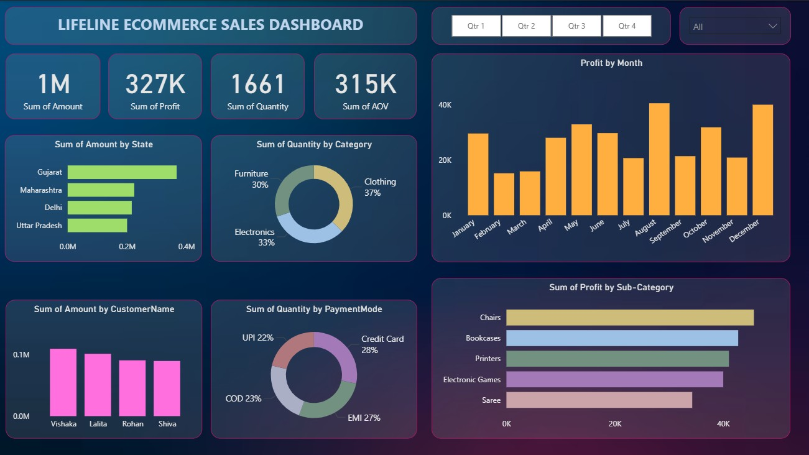

# Lifeline Ecommerce Sales Dashboard 📊

## Overview
This project contains an **interactive Power BI dashboard** that analyzes and visualizes sales performance for **Lifeline Store**.  
It helps in identifying sales trends, profit distribution, customer segmentation, and payment mode preferences.

---

## Dashboard Preview

---

## Key Insights
- 💰 **Total Sales:** 1M  
- 📈 **Total Profit:** 327K  
- 📦 **Total Quantity Sold:** 1661  
- 📊 **Average Order Value (AOV):** 315K  

### Highlights:
- **Top States by Sales:** Gujarat, Maharashtra, Delhi, Uttar Pradesh
- **Top Product Categories:** Clothing (37%), Electronics (33%), Furniture (30%)
- **Preferred Payment Modes:** Credit Card, EMI, COD, UPI
- **Seasonal Profit Peaks:** August & December

---

## Project Files
- `Dashboard.pbix` – Main Power BI dashboard file
- `Dashboard_Visuals.pdf` – Static visuals of the dashboard
- `Details.csv` & `Orders.csv` – Datasets
- `background.jpg` – Dashboard design background

---

## How to Use
1. Download the `Dashboard.pbix` file.
2. Open with **Power BI Desktop**.
3. If data paths break, point Power BI to the included CSV files.
4. Explore insights with filters and slicers.

---

## Tools Used
- Power BI Desktop  
- CSV Data Processing  
- Data Visualization & Analytics  
